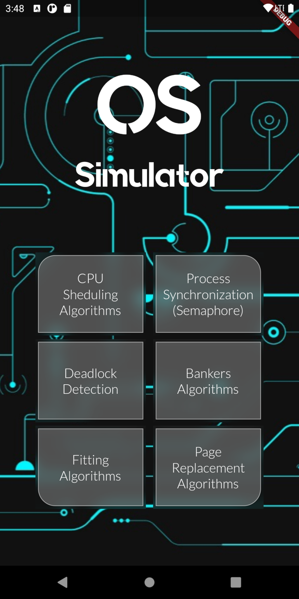
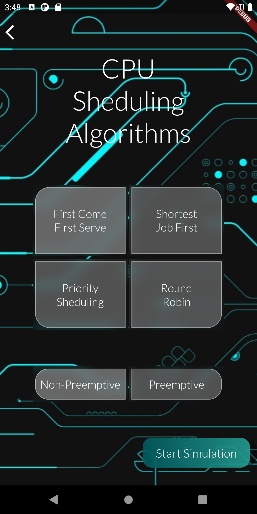
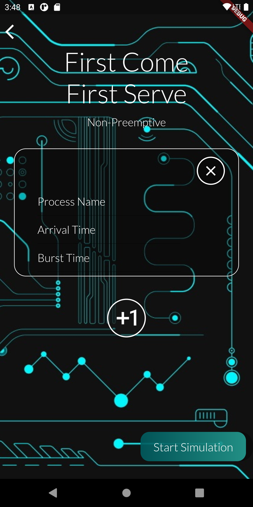
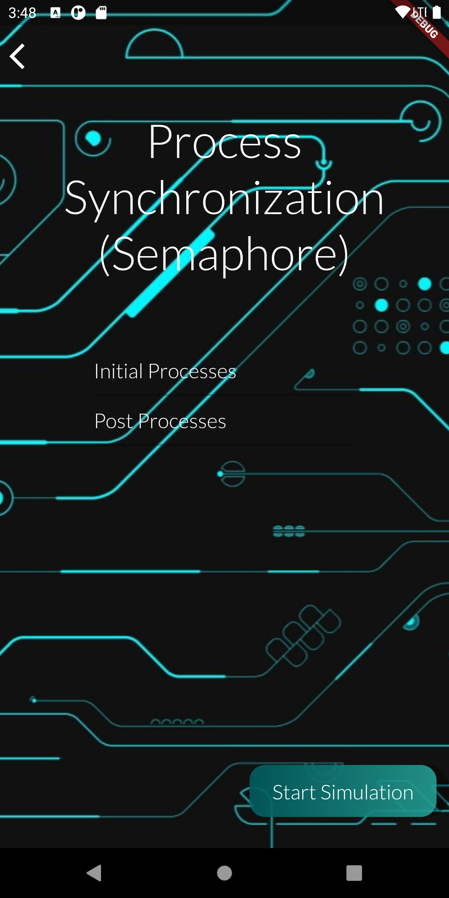
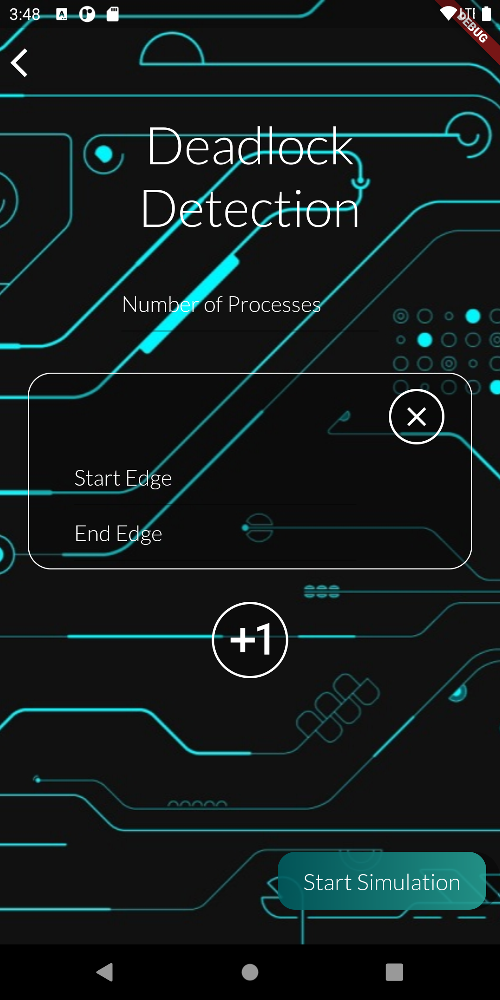
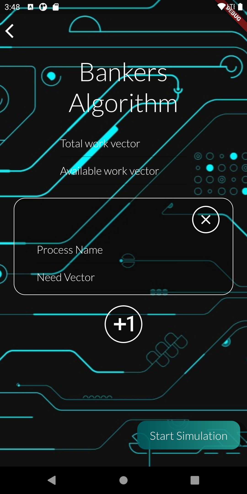
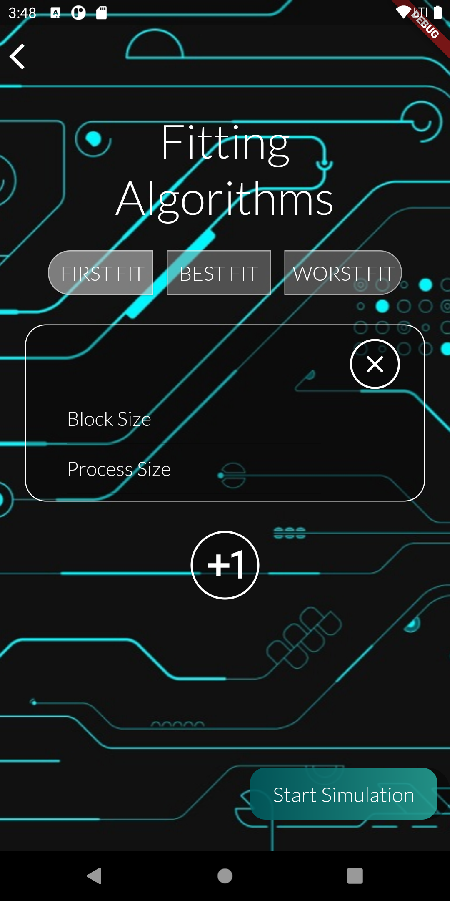
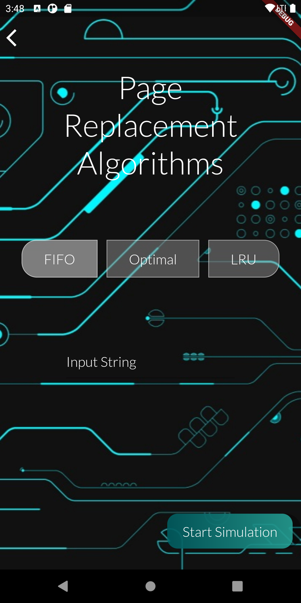

# OS Simulator App

This is a flutter project, which will provide an interface through which you can simulate multiple OS Algorithms.
One can use this interface for my previous project, an *OS_Flask_API* which has multiple *OS-Algorithms*. To clone that repo

```bash
git clone https://github.com/Anushakhalil/OS-Flask-API
```

## How To Use
1. Install Android Studio
2. Install flutter and dart plugins

3. Then clone the repository
```bash
git clone https://github.com/Anushakhalil/OS_Simulator
```

4. Open the project on any editor i.e VSCode or Android Studio
5. Launch the virtual device from AVD manager in Android Studio
6. Then Run the command on the terminal to start the app.

```bash
flutter run
```

### App Interface
**MainMenu Page** <br/>
    The main menu page contains:
    1. Cpu-Sheduling <br/>
    2. Process Synchronization (Semaphore) <br/>
    3. Deadlock Detection <br/>
    4. Bankers-Algorithm <br/>
    5. Fitting-Algorithm <br/>
    6. Page-Replacement <br/>





1. **Cpu-Sheduling** <br/>
    - Algorithms (FCFS, SJF, Priority, RR)
    - Type (Non-p, p)  




*Under Cpu-Sheduling comes the algo-details screen*  

**Algo-details** <br/>
    - Process Name <br/>
    - Arrival Time <br/>
    - Burst Time





2. **Process Synchronization (Semaphore)**  <br/>
    - Initial Processes
    - Post Processes





3. **Deadlock Detection** <br/>
    - Number of processes
    - Processes:
        - Start Edge
        - End Edge





4. **Bankers-Algorithm** <br/>
    - TotalWorkVector
    - AvailableWorkVector
    - Processes:
        - Process Name
        - Need Vector





5. **Fitting-Algorithm** <br/>
    - Type (FIRST FIt, BEST FIT, WORST FIT)
    - Processes:
        - Process Size
        - Block Size





3. **Page-Replacement** <br/>
    - Type (FIFO, OPTIMAL, LRU)
    - ReferenceString



